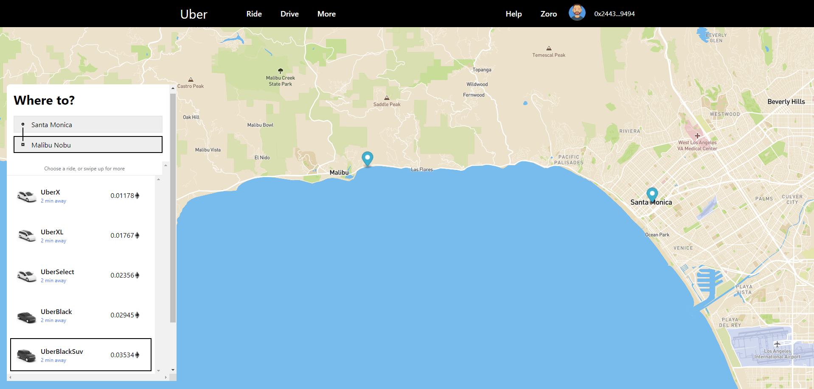

# Web3 Uber 
> Web3 Uber - Request a ride to your favorite destination and pay with $ETH Ξ
> Utilized Next.js, Tailwind.css, Ethers.js, Vercel.io and GROQ (Sanity.io)

 

## Meta

0x-Zoro

Distributed under the XYZ license. See ``LICENSE`` for more information.

[https://github.com/0x-Zoro/](https://github.com/0x-Zoro)